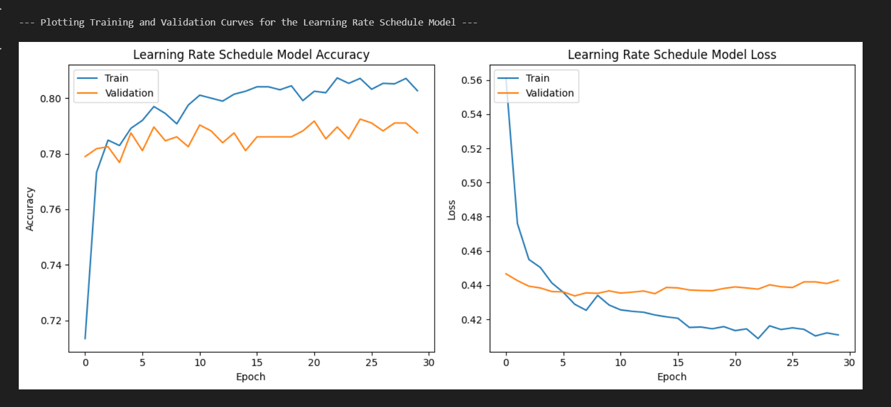

# Telco Customer Churn Analysis

This project analyzes customer churn using Python and Jupyter notebooks with the Telco Customer Churn dataset.

The work was developed as part of machine learning coursework and demonstrates data preprocessing, feature preparation, exploratory analysis, and predictive modeling workflow across multiple notebooks.

---

## Files

```text id="1lm5v9"
telco-customer-churn-analysis
│
├── data_preprocessing.ipynb      # Data preparation and feature handling
├── deep_learning_analysis.ipynb  # Main modeling and analysis notebook
├── WA_Fn-UseC_-Telco-Customer-Churn.csv   # Dataset
└── README.md
```

---

## Project Overview

This project follows a staged notebook workflow:

* Load and inspect customer churn data
* Clean and prepare features for analysis
* Transform categorical and numeric variables
* Explore customer churn patterns
* Build predictive modeling workflow across notebooks

---

## Technologies Used

* Python
* Jupyter Notebook
* Pandas
* NumPy
* Matplotlib
* Scikit-learn / Deep learning libraries used in notebook workflow

---

## Dataset

Dataset used:

WA_Fn-UseC_-Telco-Customer-Churn.csv

The dataset contains customer demographic information, account details, and service usage variables used to study churn behavior.

---

## Results

This project demonstrates how customer account features can be prepared for churn prediction analysis.

Key outcomes include:

* structured preprocessing of customer records
* feature preparation for machine learning input
* staged notebook workflow separating preprocessing and analysis
* predictive modeling experimentation for churn-related classification

---

## Example Output

The screenshot below shows sample notebook output from the analysis workflow.



---

## How to Run

Open the notebooks in Jupyter Notebook or Google Colab (recommended) and run cells in order.

Recommended sequence:

1. data_preprocessing.ipynb
2. deep_learning_analysis.ipynb

---

## Author

John Pleasant
Computer Science Student
